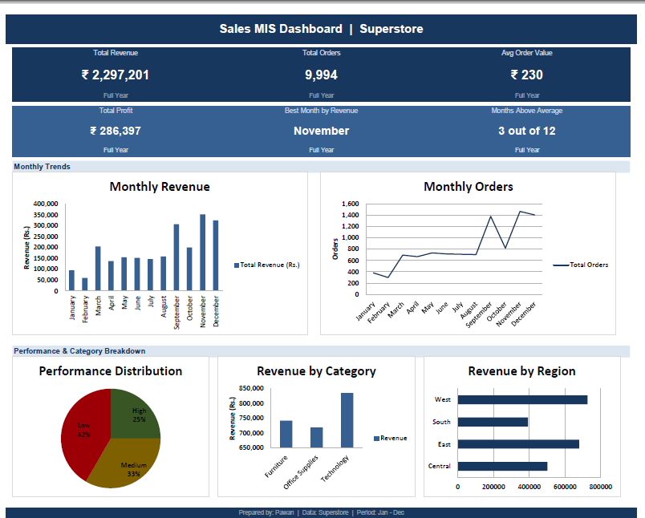

# Sales MIS Dashboard — Excel

## Overview
Monthly MIS reporting dashboard built on Superstore sales data.
Tracks revenue, orders, profit and performance across 12 months.

## What It Does
- Automated monthly revenue and order tracking using SUMIF and COUNTIF
- Performance classification using dynamic AVERAGE-based IF logic
- Target vs Actual comparison with MoM Growth calculation
- 6 KPI cards and 5 charts for stakeholder reporting
- Regional and category level revenue breakdown

## Formulas Used
SUMIF, COUNTIF, IF, AVERAGE, INDEX, MATCH, IFERROR

## Tools
Microsoft Excel
